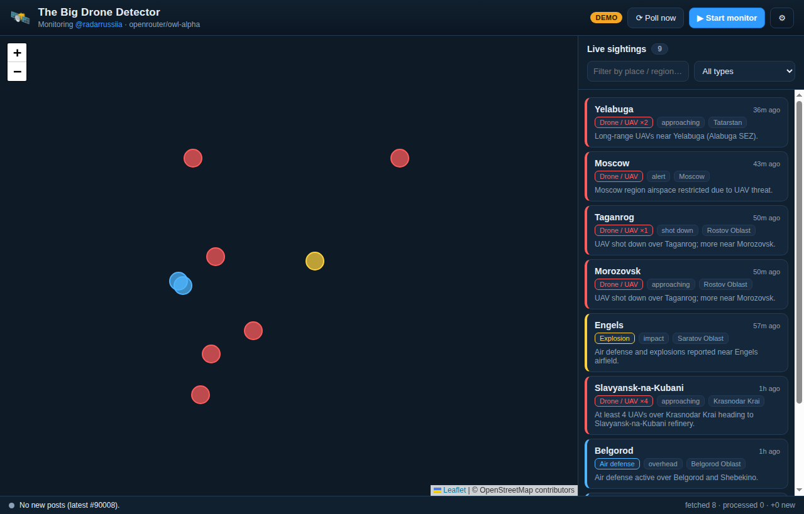

# 🛰️ The Big Drone Detector

A cross-platform **desktop app** that monitors the public Telegram channel
[**@radarrussiia**](https://t.me/radarrussiia), uses an **OpenRouter** LLM
(`openrouter/owl-alpha`) to read each post and extract structured drone / air‑threat
sightings, geocodes them, and plots them **live on a map**.

> ⚠️ **Disclaimer.** This is an OSINT / educational tool. It reads a *public*
> Telegram channel and summarises it with an LLM. Reports from such channels are
> unverified and often inaccurate; treat everything as low‑confidence signal, not
> ground truth. Respect Telegram's and OpenRouter's terms of service.



---

## How it works

```
 ┌──────────────┐   ┌─────────────────┐   ┌────────────┐   ┌──────────┐   ┌─────────┐
 │  Telegram    │ → │  OpenRouter LLM │ → │  Geocoder  │ → │  Store   │ → │  Map UI │
 │ t.me/s/<ch>  │   │ owl-alpha (JSON)│   │ gazetteer+ │   │ dedup +  │   │ Leaflet │
 │ (public web) │   │ extract sights  │   │ Nominatim  │   │ retention│   │ markers │
 └──────────────┘   └─────────────────┘   └────────────┘   └──────────┘   └─────────┘
```

1. **Fetch** – reads the channel's *public* web preview at `https://t.me/s/radarrussiia`.
   No Telegram account, bot token, or API keys are required.
2. **Extract** – each new post is sent to `openrouter/owl-alpha`, which returns
   strict JSON describing every threat mentioned (location, region, type, count,
   heading, status, confidence). Non‑relevant posts (ads, chatter) are ignored.
3. **Geocode** – locations are resolved to coordinates using a bundled offline
   **gazetteer of ~120 Russian places** (instant, no network), with **Nominatim
   (OpenStreetMap)** and confident LLM coordinates as fallbacks.
4. **Map** – sightings appear as colour‑coded markers (drone / missile / air
   defense / explosion) on a Leaflet map, plus a live, filterable sidebar. Click a
   marker or card to jump to it and open the original Telegram post.

The app polls on an interval, de‑duplicates by post id, persists sightings between
runs, and prunes anything older than the retention window.

---

## 🪟 Get the Windows app (just download & double-click)

You don't need Node or any developer tools to *run* the app — only to build it.

**Option A — download a pre-built `.exe` (recommended).**
Build artifacts are produced by GitHub Actions:
1. Go to the repo's **Actions** tab → **Build Windows app** → run it (or push a
   `v*` tag to also create a Release).
2. Download the artifact `windows-app`. It contains two files:
   - **`The Big Drone Detector-1.0.0-x64.exe`** — installer (Start-menu + desktop
     shortcut). Run it, then launch from the Start menu.
   - **`The Big Drone Detector-1.0.0-portable.exe`** — a single portable file; just
     double-click it, nothing to install.
3. First launch: open **⚙ Settings**, paste your free
   [OpenRouter API key](https://openrouter.ai/keys), and press **▶ Start monitor**.
   *(Or flip on Demo mode to try it with no key.)*

> Windows SmartScreen may warn because the build is unsigned — click
> **More info → Run anyway**.

**Option B — run from source with one double-click.**
Install [Node.js](https://nodejs.org/) (LTS), then double-click
**`run-on-windows.bat`**. It installs dependencies on first run and starts the app.

---

## Quick start (from source, any OS)

### Prerequisites
- **Node.js 18+** (Node 22 recommended)
- An **OpenRouter API key** — free to create at <https://openrouter.ai/keys>
  *(not needed for Demo mode)*

### Install & run
```bash
git clone https://github.com/Inasjackw321/the-big-drone-detector.git
cd the-big-drone-detector
npm install
npm start
```

On first launch, open **⚙ Settings**, paste your OpenRouter API key, and press
**▶ Start monitor**. That's it.

### Build your own installer
```bash
npm run dist:win     # Windows: NSIS installer + portable .exe  (build on Windows)
npm run dist:mac     # macOS .dmg   (build on macOS)
npm run dist:linux   # Linux AppImage
```
Output lands in `dist/`. Building a Windows target on Linux requires Wine; the
included GitHub Actions workflow builds it natively on `windows-latest` instead.

### Try it with no API key — Demo mode
```bash
npm run demo
```
Demo mode runs the **full pipeline** (extract → geocode → map) against a set of
bundled, realistic sample posts, so you can see everything working offline. You can
also toggle Demo mode in **⚙ Settings**.

---

## Configuration

Settings can be changed in the in‑app **⚙ Settings** panel (persisted to your user
data folder) or via environment variables / a `.env` file. Copy `.env.example` to
`.env`:

| Variable | Default | Description |
| --- | --- | --- |
| `OPENROUTER_API_KEY` | – | Your OpenRouter key (required for live mode). |
| `OPENROUTER_MODEL` | `openrouter/owl-alpha` | Model used for extraction. Any OpenRouter chat model works. |
| `TELEGRAM_CHANNEL` | `radarrussiia` | Public channel username to monitor (no `@`). |
| `POLL_INTERVAL_SECONDS` | `120` | How often to poll the channel. |
| `DDX_RETENTION_HOURS` | `24` | Drop sightings older than this from the map. |
| `DDX_DEMO` | `0` | Set `1` to start in demo mode. |

Your API key is stored locally (settings file in Electron's `userData` dir) and is
sent **only** to OpenRouter.

---

## Headless / CLI mode

A no‑GUI runner is included for debugging or automation:

```bash
node src/cli.js --demo     # one cycle over bundled sample posts (offline)
node src/cli.js            # one live cycle (needs OPENROUTER_API_KEY)
node src/cli.js --watch    # keep polling on the configured interval
```

Example demo output:
```
[processing] Analyzing 8 new post(s)…
  📍 Voronezh (Voronezh Oblast) [drone] 51.661,39.200 via gazetteer
  📍 Belgorod (Belgorod Oblast) [air_defense] 50.598,36.586 via gazetteer
  ...
```

---

## Project layout

```
src/
  main.js                 Electron main process (windows, IPC, lifecycle)
  preload.js              Secure IPC bridge (contextIsolation)
  config.js               Settings: env / .env / persisted JSON
  cli.js                  Headless pipeline runner
  services/
    telegram.js           Fetch + parse the public t.me/s preview (no deps)
    openrouter.js         owl-alpha client + JSON extraction/validation
    geocode.js            Offline gazetteer + Nominatim + LLM-coord fallback
    store.js              Dedup, persistence, time-based retention
    pipeline.js           Orchestration + event emitter
    demo.js               Offline sample posts + mock LLM
  data/ru-gazetteer.json  ~120 Russian places with coordinates
  renderer/               Leaflet map UI (vendored Leaflet, no CDN)
test/                     Unit + end-to-end tests (node:test, no deps)
```

## Tests

```bash
npm test
```
Runs 26 tests covering the Telegram parser, the OpenRouter JSON
extraction/validation, the geocoder, and a full offline pipeline run — all with
zero network access and no external dependencies.

---

## Building installers (optional)

The app runs directly with `npm start`. To produce distributable desktop installers
(`.exe`, `.dmg`, `.AppImage`), add a packager such as
[`electron-builder`](https://www.electron.build/) or
[`@electron-forge`](https://www.electronforge.io/) and point it at `src/main.js`.

## Notes & limitations
- Only **public** Telegram channels are readable via the web preview. For private
  channels you'd need the Telegram client API (MTProto) — out of scope here.
- `openrouter/owl-alpha` is a free/stealth model and may change or rate‑limit; set
  `OPENROUTER_MODEL` to any other OpenRouter model if it's unavailable.
- Map tiles come from OpenStreetMap and require an internet connection at runtime.

## License
MIT
